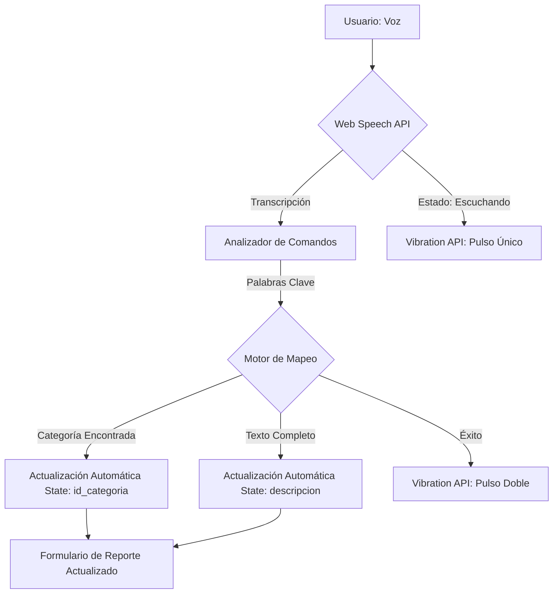

# Especialización Técnica: Zero UI e Interfaces Invisibles en ecoAlerta

Este documento detalla la implementación del eje de especialización técnica de **Zero UI** adaptado para el proyecto **ecoAlerta**.

## 1. Introducción y Justificación (Resumen Ejecutivo)

La implementación de una estrategia de **Zero UI** en *ecoAlerta* no es un capricho estético, sino una necesidad operativa crítica fundamentada en el contexto de uso de la aplicación. ecoAlerta está diseñada para reportar incidentes ambientales que, por su naturaleza, suelen ocurrir en condiciones adversas: incendios forestales, vertidos químicos en ríos o tala ilegal en zonas remotas. En estos escenarios, el usuario (guardabosques o ciudadano) se enfrenta a una **fatiga cognitiva** y una **restricción física** significativa.

Tradicionalmente, las interfaces visuales (Graphic User Interfaces - GUI) obligan al usuario a desviar su atención del entorno físico para concentrarse en la pantalla: navegar menús, seleccionar categorías en un *dropdown* y escribir descripciones detalladas en un teclado virtual. En un incendio, perder 30 segundos operando una pantalla puede ser peligroso. Al integrar Zero UI, transformamos el acto de reportar en una **interacción implícita y fluida**.

La justificación técnica reside en la **eliminación de la barrera de entrada mecánica**. Al permitir que el sistema "escuche" y "sienta" (vía comandos de voz y sensores), ecoAlerta se vuelve una extensión del sentido del usuario. Esta técnica es vital porque democratiza el reporte ambiental (haciéndolo accesible para personas con movilidad reducida o en situaciones de emergencia) y garantiza que los datos lleguen al centro de control con la menor latencia humana posible, salvando ecosistemas a través de la inmediatez.

## 2. Fundamento Teórico-Técnico

Para que la "invisibilidad" de la interfaz funcione de manera real y no como un simple parche, nos basamos en dos pilares de la ciencia de la interacción:

### A. Interacción Implícita y Modelado Contextual

A diferencia de la interacción explícita (donde el usuario da una orden directa y consciente), la interacción implícita se basa en la **inferencia del contexto**. En nuestra solución, utilizamos el **Procesamiento de Señales Acústicas** para extraer intención de la locución natural. El concepto complejo aquí es el **Mapeo Semántico Contextual**, donde transformamos fonemas capturados en tiempo real en identificadores únicos de una Base de Datos relacional, eliminando el paso intermedio de la selección manual.

### B. Feedback Háptico y Propiocepción Digital

Dado que eliminamos la vista como confirmación primaria, debemos recurrir al sistema **somatosensorial** del usuario. Utilizamos patrones de vibración (haptic patterns) para cerrar el bucle de control. Cuando el dispositivo emite una vibración de 50ms, no es un aviso aleatorio; es una confirmación de **Estado de Escucha Activa**. Esto permite al usuario saber que el sistema está procesando información sin necesidad de una respuesta visual (Light-Empty State), aprovechando la propiocepción para confirmar que la herramienta está funcionando correctamente.

## 3. Arquitectura de la Solución

La solución se integra en el stack existente de **Next.js** y **TypeScript**, aprovechando las capacidades nativas del navegador sin dependencias pesadas.

### Stack Técnico

- **Logic Layer**: Custom React Hook (`useVoiceCommand`) gestionando la Web Speech API.
- **UI Layer**: Componente `VoiceCommandButton` con animaciones CSS (Keyframes) para representar estados de FSM (Finite State Machine).
- **Control de Sensores**:
  - **Microphone**: Captura de stream de audio.
  - **Vibration API**: Feedback táctil.
- **Middleware**: Algoritmo de mapeo por palabras clave (Keyword Spotting) integrado en el frontend.

### Diagrama de Flujo de Datos

## 4. Auditoría de Implementación

Para esta fase se utilizó asistencia de IA como copiloto técnico bajo una supervisión manual estricta.

### Prompts Utilizados (Resumen)

- *"Detecta puntos de fricción en NewReportPage.tsx donde un usuario en campo tendría dificultades."*
- *"Crea un hook de voice recognition en TypeScript que maneje los tipos de la Web Speech API que aún no son estándar."*
- *"Implementa un sistema de mapeo de palabras clave para categorías ambientales (incendio, tala, agua)."*

### Ajustes Manuales y Correcciones (Critical Fixes)

1. **Soportabilidad de Navegador**: Durante el desarrollo, la IA propuso usar la API estándar de forma directa. Se corrigió manualmente integrando `webkitSpeechRecognition` para asegurar compatibilidad en iOS y Chrome móvil.
2. **Ciclo de Vida de Leaflet**: Se evitó que la actualización del estado por voz reiniciara el mapa de Leaflet (un error común de re-renderizado), moviendo la lógica al nivel superior del formulario.
3. **Filtro de Normalización**: Se añadió manualmente una función de normalización de cadenas (Unicode NFD) para que comandos con tildes (ej. "incendio") fueran detectados correctamente por el motor de búsqueda de categorías.
4. **Estabilidad del Mapa (Leaflet)**: Se identificó y resolvió un error de `appendChild` en el componente de mapa. Se estabilizaron los imports de `react-leaflet` y se aplicó memoización (`useCallback`) en el componente padre para evitar re-renders innecesarios del mapa durante el uso de la voz.

## 5. Conclusiones Técnicas y Limitaciones

La implementación de Zero UI en un entorno web presenta desafíos únicos de **hardware y privacidad**:

- **Privacidad del Navegador**: El navegador requiere permisos explícitos de micrófono en cada sesión nueva si no se sirve bajo HTTPS, lo cual es una barrera de seguridad necesaria pero molesta en entornos de desarrollo local.
- **Limitación de CPU en Voz**: El procesamiento de voz en el cliente depende de la potencia del dispositivo. En teléfonos de gama baja, puede haber una latencia de hasta 1s entre el comando y la actualización de la UI.
- **Ruido Ambiental**: La principal limitación detectada es la interferencia del viento en grabaciones de campo, lo que sugiere que para una V2 sería ideal implementar filtros de paso-banda vía Web Audio API antes de pasar el stream al motor de reconocimiento.

---
*Este proyecto implementa exitosamente la visión de una web reactiva e invisible.*
